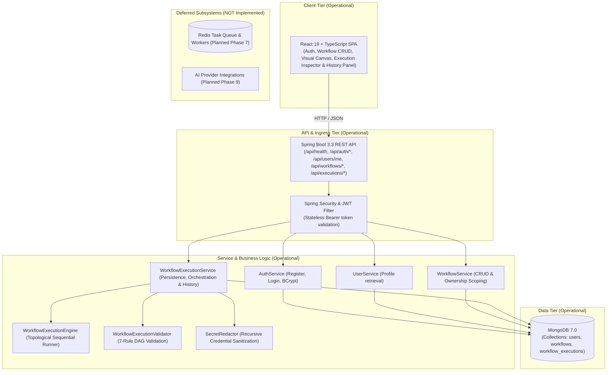

# Adonis Architecture Overview

This document describes the high-level architecture, design principles, and component interactions for the **Adonis** workflow automation platform.

---

## 1. System Vision

Adonis is designed as an event-driven, developer-centric workflow orchestration platform. It balances visual simplicity on the frontend with robust, resilient backend execution using Java 21 and Spring Boot.

### Core Architectural Principles
- **Separation of Concerns**: Visual modeling (Frontend) is decoupled from workflow compilation, validation, and execution (Backend).
- **Extensible Node Ecosystem**: Nodes (triggers, actions, transformers, AI nodes) follow a uniform interface allowing plug-and-play expansions.
- **Fail-Safe & Idempotent**: Step-level retries, execution state journaling, and isolated asynchronous execution.
- **Developer First**: Fully inspectable execution traces, structured logs, and webhook triggers.

---

### 2. Current Architecture (Phase 10 Operational)

In Phase 10, the operational system topology integrates a comprehensive **Automated Integration Testing & Testcontainers Architecture** alongside the Phase 9 provider-neutral **AI Execution Layer** (`OpenAIProvider`, `GeminiProvider`, `PromptInterpolator`, `JsonSchemaValidator`):

### Trigger & Execution Layer Architecture

```text
                 ┌───────────────┐
                 │ Manual API    │
                 └───────┬───────┘
                         │
                 ┌───────▼───────┐
                 │ Scheduler     │
                 └───────┬───────┘
                         │
                 ┌───────▼───────┐
                 │ Webhook API   │
                 └───────┬───────┘
                         │
                         ▼
               WorkflowExecutionService
                         │
                         ▼
                  Redis Streams
                         │
                         ▼
                  ExecutionWorker
                         │
                         ▼
               WorkflowExecutionEngine
               ┌─────────┴─────────┐
               ▼                   ▼
        Standard Nodes        AI Nodes (OpenAI, Gemini)
               │                   │
               └─────────┬─────────┘
                         ▼
                      MongoDB
```

### End-to-End System Topology

```text
React (Vite + TypeScript + Tailwind + @xyflow/react)
   ├── Visual Workflow Builder (Canvas, MiniMap, Controls, Background)
   ├── Node Palette (Trigger, HTTP Request, Generic, AI Text Gen, AI Structured Output) & Config Drawer
   ├── Trigger Configuration (Manual, Cron Schedule, Webhook Capability URL & Secret)
   ├── AI Configuration (Provider, Model, Prompts, Temperature, Tokens, JSON Schema)
   ├── Run Workflow Action, Execution Results Modal & Execution History Panel
   └── Polling Client (1.5s interval until SUCCESS or FAILED)
   ↓ HTTP / JSON (Bearer JWT, CORS-enabled, 202 Accepted)
Spring Boot REST API (Java 21, Spring Boot 3.3.4)
   ├── WorkflowController (Manual POST /api/workflows/{id}/execute)
   ├── WebhookController (Public POST /api/webhooks/{webhookPath} with secret & idempotency)
   └── AdonisScheduler (Centralized Spring scheduled cron evaluator)
   ↓
Spring Security + JWT (Stateless filter, BCrypt password encoder, public webhooks permitAll)
   ↓
Service Layer (AuthService, UserService, WorkflowService, WorkflowExecutionService)
   ↓ Enqueue ExecutionJob (executionId, workflowId, userId, triggerType, queuedAt)
ExecutionQueue Abstraction
   ↓
Redis 7 Streams (XADD adonis:execution:stream)
   ↓
Consumer Group (adonis-workers, XREADGROUP, PEL crash recovery)
   ↓
ExecutionWorker (SmartLifecycle, Atomic findAndModify QUEUED -> RUNNING, XACK on persistent completion)
   ↓
Execution Engine (Topological Sort, RetryPolicy, Fail-Fast Runner)
   ├── WorkflowExecutionValidator (7-rule graph, trigger, and node-level schema validation)
   ├── WorkflowExecutionEngine (sequential execution, upstream resolution & TriggerContext injection)
   ├── NodeExecutors:
   │   ├── TriggerNodeExecutor (Manual, Schedule, Webhook)
   │   ├── HttpRequestNodeExecutor (real outbound HTTP via native HttpClient)
   │   ├── GenericNodeExecutor (safe pass-through)
   │   ├── AITextGenerationNodeExecutor (OpenAI / Gemini text generation)
   │   └── AIStructuredOutputNodeExecutor (OpenAI / Gemini structured JSON with schema validation)
   ├── AI Provider Layer (AIProvider SPI, OpenAIProvider, GeminiProvider, PromptInterpolator)
   ├── RetryPolicy (exponential backoff, attempt tracking, and failure classification)
   └── SecretRedactor (deep sanitization of sensitive headers, tokens, and OpenAI/Gemini credentials)
   ↓
MongoDB (Spring Data MongoDB, 7.0 container)
   ├── Collection: users (unique index on lowercase email)
   ├── Collection: workflows (nodes, edges, triggerType, triggerConfig, indexed by userId)
   ├── Collection: workflow_executions (status, timestamps, triggerType, scheduledOccurrence, idempotencyKey, triggerPayload)
   └── Collection: scheduled_occurrences (compound unique index on workflowId + scheduledFireTime)
```

### Component Status (Implemented vs. Deferred)

| Subsystem / Component | Current Status | Milestone |
|---|---|---|
| **Core Monorepo & Build Pipeline** | **Operational** | Phase 0 (Completed) |
| **Spring Boot 3.3 REST Baseline** | **Operational** (`GET /api/health`) | Phase 0 (Completed) |
| **React + TypeScript UI Shell** | **Operational** (Landing & Diagnostics) | Phase 0 (Completed) |
| **MongoDB Persistence** | **Operational** (Documents `User`, `Workflow`, `WorkflowExecution`, `ScheduledOccurrence`) | Phase 1, 2, 3, 5 & 8 (Completed) |
| **Authentication & User Management** | **Operational** (Stateless JWT + BCrypt) | Phase 1 (Completed) |
| **Protected User Profile API** | **Operational** (`GET /api/users/me`) | Phase 1 (Completed) |
| **Workflow CRUD APIs** | **Operational** (`POST/GET/PUT/DELETE /api/workflows`) | Phase 2 (Completed) |
| **React Flow Visual Canvas** | **Operational** (`@xyflow/react` v12 visual builder) | Phase 3 (Completed) |
| **Workflow Execution Engine** | **Operational** (Topological DAG, fail-fast core) | Phase 4 (Completed) |
| **Execution History & Logs** | **Operational** (Persistent records, skipped nodes, redacting, pagination) | Phase 5 (Completed) |
| **Retries & Failure Handling** | **Operational** (Exponential backoff, failure classification, attempt tracking) | Phase 6 (Completed) |
| **Redis Asynchronous Workers** | **Operational** (Redis 7, ExecutionQueue, ExecutionWorker, 202 Accepted, Idempotency) | Phase 7 (Completed) |
| **Scheduling & Webhooks** | **Operational** (Cron, Timezones, Capability URLs, Secret Auth, Idempotency) | Phase 8 (Completed) |
| **AI Intelligent Nodes** | **Operational** (`ai_text_generation`, `ai_structured_output`, OpenAI & Gemini SPI) | Phase 9 (Completed) |
| **Automated Testing & Testcontainers** | *NOT Implemented* | Phase 10 (Testcontainers deferred to Phase 10) |
| **Production Docker Deployment** | *NOT Implemented* | Phase 11 (Docker + Deployment) |
| **CI/CD & Production Hardening** | *NOT Implemented* | Phase 12 (Production Hardening) |**AI Intelligent Nodes** | *NOT Implemented* | Phase 9 (AI Nodes) |
| **Automated Testing & Testcontainers** | *NOT Implemented* | Phase 10 (Testcontainers deferred to Phase 10) |
| **Production Docker Deployment** | *NOT Implemented* | Phase 11 (Docker + Deployment) |
| **CI/CD & Production Hardening** | *NOT Implemented* | Phase 12 (Production Hardening) |

> **Explicit Boundary & Design Principles**:
> - **In-Process & Synchronous Execution**: In Phase 6, execution remains strictly synchronous and in-process within the HTTP request lifecycle. Retries and exponential backoff are performed synchronously via pluggable `RetryDelayStrategy` (defaulting to `Thread.sleep` in production, non-blocking in tests). No background workers, asynchronous queues, job runners, Redis, or Kafka are introduced (deferred to Phase 7).
> - **Failure Classification & Fast Fail**: Failures are classified via `FailureClassifier`. Non-retryable errors (e.g. HTTP 400, 401, 403, 404, invalid URLs) abort retries immediately and fail fast. Retryable errors (e.g. HTTP 408, 429, 500, 502, 503, 504, connection timeouts, refused connections) trigger exponential backoff up to `maxRetries` (retries *after* initial attempt).
> - **Granular Attempt Tracking & Persistence**: Every attempt executed for a node is recorded in `NodeExecutionAttempt` (attempt number, status, timestamps, duration, input, output, error) and persisted within `NodeExecution.attempts` in MongoDB.
> - **Secret Redaction**: Inputs, outputs, and errors are deeply sanitized across every attempt prior to persistence and API response via `SecretRedactor`.
> - **Ownership Isolation**: All execution history endpoints enforce user ownership (`findByIdAndUserId` and `workflowRepository.findByIdAndUserId`). Unauthorized or nonexistent executions return `404 Not Found`.

---

## 3. Workflow Domain & Ownership Isolation

### Workflow Document Structure
Each workflow document in MongoDB (`workflows` collection) represents a persistent graph definition:
- `id`: Unique identifier (auto-generated MongoDB ObjectID string).
- `userId`: Owner ID, strictly set from the verified `UserPrincipal.id()` in JWT.
- `name`: Workflow title (1–100 characters, required).
- `description`: Optional overview (up to 500 characters).
- `status`: Lifecycle state (`DRAFT`, `ACTIVE`).
- `nodes`: List of `WorkflowNode` objects (`id`, `type`, `data`).
- `edges`: List of `WorkflowEdge` objects (`id`, `source`, `target`).
- `createdAt` / `updatedAt`: Server-managed timestamps.

### Ownership Enforcement & Security Guarantees
1. **No Client-Controlled Ownership**: The client cannot specify or mutate `userId`.
2. **Database-Level Isolation**:
   - `findByUserId(userId)` ensures a user's listing only scans and returns their own workflows.
   - `findByIdAndUserId(id, userId)` scopes retrieval, mutation, and deletion to the owner at query time.
3. **No Cross-Tenant Existence Leaks**: Attempting to query, update, or delete a workflow belonging to another user returns `404 Not Found` (never 403), entirely hiding whether the workflow ID exists.

---

## 3. Workflow & Execution Domain & Ownership Isolation

### Workflow Document Structure
Each workflow document in MongoDB (`workflows` collection) represents a persistent graph definition:
- `id`: Unique identifier (auto-generated MongoDB ObjectID string).
- `userId`: Owner ID, strictly set from the verified `UserPrincipal.id()` in JWT.
- `name`: Workflow title (1–100 characters, required).
- `description`: Optional overview (up to 500 characters).
- `status`: Lifecycle state (`DRAFT`, `ACTIVE`).
- `nodes`: List of `WorkflowNode` objects (`id`, `type`, `data`, `position`).
- `edges`: List of `WorkflowEdge` objects (`id`, `source`, `target`, `sourceHandle`, `targetHandle`).
- `createdAt` / `updatedAt`: Server-managed timestamps.

### Workflow Execution Document Structure
Each workflow execution document in MongoDB (`workflow_executions` collection) represents a persistent runtime audit trace:
- `id`: Unique identifier (auto-generated MongoDB ObjectID string).
- `workflowId`: Associated workflow ID (indexed).
- `userId`: Owner ID, strictly set from JWT principal (indexed).
- `status`: Execution state (`RUNNING`, `SUCCESS`, `FAILED`).
- `triggerType`: Trigger type identifier (e.g. `manual`).
- `startedAt`: Timestamp when execution commenced (indexed for descending sort).
- `completedAt`: Timestamp when execution completed.
- `durationMs`: Total duration in milliseconds.
- `nodeExecutions`: Embedded list of `NodeExecution` objects:
  - `nodeId`: ID of the node.
  - `nodeType`: Type (`trigger`, `httpRequest`, `generic`).
  - `status`: Step outcome (`SUCCESS`, `FAILED`, `SKIPPED`).
  - `startedAt` / `completedAt`: Node timestamps.
  - `durationMs`: Node runtime in milliseconds (0ms for skipped nodes).
  - `input`: Deeply sanitized node input map (sensitive keys redacted).
  - `output`: Deeply sanitized node output map (sensitive keys redacted).
  - `error`: Error message if step failed.
- `error`: Overall failure summary message if workflow execution failed.

### Ownership Enforcement & Security Guarantees
1. **No Client-Controlled Ownership**: The client cannot specify or mutate `userId` on workflows or executions.
2. **Database-Level Isolation**:
   - `findByUserId(userId)` and `findAllByUserId(userId, pageable)` ensure listings only scan and return the owner's documents.
   - `findByIdAndUserId(id, userId)` scopes retrieval and mutations strictly to the owner at query time.
3. **No Cross-Tenant Existence Leaks**: Attempting to query, update, or retrieve executions/workflows belonging to another user returns `404 Not Found` (never 403), completely masking resource existence.
4. **Secret Redaction**: Authorization headers, passwords, API keys, client secrets, and bearer tokens are redacted to `[REDACTED]` before saving to MongoDB and returning in HTTP responses.

---

## 4. High-Level Topology (Operational vs Planned)



---

## 5. Current Request Flows

```
[Browser / React App] 
      │
      ├── POST /api/auth/register             ──> Validates input, hashes password (BCrypt), persists User to MongoDB, returns JWT
      ├── POST /api/auth/login                ──> Verifies credentials with BCrypt, returns JWT
      ├── GET  /api/users/me                  ──> Authenticated via Bearer JWT, extracts UserPrincipal, returns UserResponse
      ├── POST /api/workflows                 ──> Authenticated via JWT, binds userId = principal.id(), persists Workflow
      ├── GET  /api/workflows                 ──> Authenticated via JWT, queries findByUserId(principal.id())
      ├── GET  /api/workflows/{id}            ──> Authenticated via JWT, queries findByIdAndUserId, returns 404 on cross-user
      ├── PUT  /api/workflows/{id}            ──> Authenticated via JWT, updates mutable fields, refreshes updatedAt, returns 404 on cross-user
      ├── DELETE /api/workflows/{id}          ──> Authenticated via JWT, deletes own workflow, returns 204 (404 on cross-user)
      ├── POST /api/workflows/{id}/execute    ──> Authenticated via JWT, verifies ownership, validates DAG, persists RUNNING record, executes nodes, redacts secrets, persists outcome (SUCCESS/FAILED + SKIPPED nodes), returns WorkflowExecutionResult
      ├── GET  /api/workflows/{id}/executions ──> Authenticated via JWT, verifies workflow ownership, queries paginated execution summaries (newest first)
      ├── GET  /api/executions/{executionId}  ──> Authenticated via JWT, queries findByIdAndUserId, returns full node-by-node execution record (404 on cross-user)
      ├── GET  /api/executions                ──> Authenticated via JWT, returns paginated execution summaries for authenticated user
      └── GET  /api/health                    ──> Public health diagnostic (Phase 0)
```

---

## 6. Retries & Failure Handling (Phase 6)

Adonis implements an in-process, synchronous retry mechanism designed to make node execution resilient against temporary network partitions, rate limits, and server-side glitches without delaying execution with complex distributed broker setups.

```text
Node Execution Invocation
       │
       ▼
   Attempt 1 ──> [Success] ──> Proceed Downstream with Output
       │ (Failure)
       ▼
Is Failure Retryable? (FailureClassifier)
       ├── No (400, 401, 403, 404, invalid URLs, validation error)
       │     └──> Fast-Fail immediately (No retries wasted) ──> Workflow FAILED (Downstream SKIPPED)
       └── Yes (408, 429, 500, 502, 503, 504, timeout, network error)
             │
             ▼
       Attempts Remaining? (attempt < maxRetries)
             ├── Yes ──> Calculate Backoff (initialBackoffMs * multiplier^attempt, clamped to maxBackoffMs)
             │            │
             │            └──> RetryDelayStrategy.delay(...) ──> Execute Next Attempt
             └── No  ──> Exhausted All Retries ──> Workflow FAILED (Downstream SKIPPED)
```

### Core Architecture Components

1. **Retry Configuration (`RetryConfig`)**:
   - Embedded within `WorkflowNode.data.retryConfig` or `WorkflowNode.data.retry`.
   - Fields: `enabled` (boolean, default false), `maxRetries` (int, default 0, max 10), `initialBackoffMs` (long, default 1000ms), `backoffMultiplier` (double, default 2.0), `maxBackoffMs` (long, default 30000ms, max 60000ms).
   - Strict Semantics: `maxRetries` defines the number of retries *after* the initial failed attempt (total attempts = `1 + maxRetries`).
   - Backward Compatibility: Workflows without a `retryConfig` object default to `enabled: false, maxRetries: 0`.

2. **Decoupled HTTP Failure Semantics & Failure Classifier (`FailureClassifier`)**:
   - `HttpRequestNodeExecutor` consistently reports any HTTP status >= 400 as a failed node execution (`NodeExecutionResult.failure`) regardless of retry configuration, preventing contradictory statuses (`HTTP status = 503, success = false, Node status = SUCCESS`).
   - `FailureClassifier` alone evaluates whether the failure is temporary or permanent:
     - **Retryable**: HTTP status codes 408 (Request Timeout), 429 (Too Many Requests), 500 (Internal Server Error), 502 (Bad Gateway), 503 (Service Unavailable), 504 (Gateway Timeout); network exceptions (e.g. `ConnectException`, `SocketTimeoutException`, `HttpConnectTimeoutException`, connection refused).
     - **Non-Retryable**: HTTP status codes 400 (Bad Request), 401 (Unauthorized), 403 (Forbidden), 404 (Not Found); deterministic client errors (e.g. `IllegalArgumentException`, invalid URL schema, malformed configuration).
     - Conservative Default: Unknown errors or unclassified exceptions default to non-retryable to prevent pointless loops.

3. **Exponential Backoff & Delay Strategy (`RetryPolicy` & `RetryDelayStrategy`)**:
   - Formula: `delay = min(initialBackoffMs * (backoffMultiplier ^ (attempt - 1)), maxBackoffMs)`.
   - Pluggable `RetryDelayStrategy`:
     - Production: `RetryDelayStrategy.threadSleep()` pauses the calling thread synchronously.
     - Testing: `RetryDelayStrategy.noOp()` or mock recording strategies execute synchronously without artificial latency.

4. **Attempt Journaling & Persistence (`NodeExecutionAttempt`)**:
   - Each attempt records: `attemptNumber` (1-indexed), `status` (`SUCCESS` or `FAILED`), `startedAt`, `completedAt`, `durationMs`, `input`, `output`, and `error`.
   - Redaction: Every attempt is sanitized via `SecretRedactor` before being stored on `NodeExecution.attempts` and returned in API responses.
   - The aggregated `NodeExecution` reflects `retryCount` (number of retry attempts triggered), the overall final status, and the complete attempts array.

5. **Downstream Propagation**:
   - When a node succeeds (either on initial attempt or after N retries), its sanitized output is routed as the input to downstream nodes.
   - When a node exhausts its retries or aborts due to a non-retryable error, fail-fast stops execution immediately and unexecuted downstream nodes are marked `SKIPPED`.

---

## 7. Package Architecture (Backend)

```
backend/src/main/java/com/adonis/
├── AdonisApplication.java       # Application Bootstrap
├── config/                      # Web MVC, CORS, and HttpClient configuration
├── controller/                  # REST Controllers (HealthController, AuthController, UserController, WorkflowController, ExecutionController)
├── dto/                         # Strongly-typed Java 21 Records (CreateWorkflowRequest, WorkflowResponse, ExecutionResponse, ExecutionSummaryResponse, NodeExecutionResponse, NodeExecutionAttemptResponse, PageResponse)
├── exception/                   # Global exception handling (GlobalExceptionHandler, WorkflowValidationException, ExecutionNotFoundException)
├── execution/                   # Workflow Execution Engine, Retry Policies & Service
│   ├── ExecutionContext.java            # Runtime thread-safe execution state
│   ├── ExecutionStatus.java             # RUNNING, SUCCESS, FAILED, SKIPPED status enum
│   ├── FailureClassifier.java           # Retryable vs non-retryable error classifier
│   ├── GenericNodeExecutor.java         # Pass-through generic node executor
│   ├── HttpRequestNodeExecutor.java     # JDK HttpClient executor for GET/POST/PUT/DELETE/PATCH
│   ├── NodeExecutionResult.java         # Node execution output, duration, retry count, attempts, and error record
│   ├── NodeExecutor.java                # Extensible node executor interface
│   ├── RetryDelayStrategy.java          # Pluggable backoff delay interface (threadSleep vs noOp)
│   ├── RetryPolicy.java                 # Exponential backoff loop, attempt tracking, and logging
│   ├── TriggerNodeExecutor.java         # Starting trigger node executor
│   ├── WorkflowExecutionEngine.java     # In-process sequential runner with fail-fast semantics
│   ├── WorkflowExecutionResult.java     # Overall workflow execution outcome record
│   ├── WorkflowExecutionService.java    # Ownership lookup, persistence lifecycle & query orchestration
│   └── WorkflowExecutionValidator.java  # 7-rule graph validation & Kahn's topological sort
├── model/                       # MongoDB Document Models (User, Workflow, WorkflowNode, WorkflowEdge, WorkflowStatus, WorkflowExecution, NodeExecution, NodeExecutionAttempt, RetryConfig)
├── repository/                  # Spring Data MongoDB Repositories (UserRepository, WorkflowRepository, WorkflowExecutionRepository)
├── security/                    # SecurityConfig, JwtService, JwtAuthenticationFilter, UserPrincipal
├── util/                        # Utilities (SecretRedactor deep recursive credential sanitization)
└── service/                     # Business Logic (AuthService, UserService, WorkflowService)
```

---

## 8. Port Allocations & Networking

| Service | Internal Port | Host / Exposed Port | Protocol | Status | Purpose |
|---|---|---|---|---|---|
| `frontend` | 80 (prod) / 5173 (dev) | 5173 | HTTP | **Operational** | User Interface & Workflow CRUD Dashboard |
| `backend` | 8080 | 8080 | HTTP | **Operational** | REST API & Security Engine |
| `mongodb` | 27017 | 27017 | TCP | **Operational** | MongoDB 7.0 User & Workflow Persistence |
| `redis` | 6379 | 6379 | TCP | **Operational** | Redis 7 persistent execution queue |

---

## 9. Phase 7 & 7.1: Redis Asynchronous Workers & Reliability Hardening Architecture

### 9.1 Architectural Flow

```text
                    ┌─────────────────┐
                    │   REST API      │
                    │ (POST /execute) │
                    └────────┬────────┘
                             │ Returns 202 Accepted immediately
                             ▼
                  ┌────────────────────┐
                  │ Execution Service  │
                  │ (status = QUEUED)  │
                  └─────────┬──────────┘
                            │ Enqueues ExecutionJob
                            ▼
                     ┌─────────────┐
                     │    Redis    │
                     │    Queue    │
                     └──────┬──────┘
                            │ BLPOP / leftPop
                            ▼
                 ┌─────────────────────┐
                 │   Worker Process    │
                 │                     │
                 │ WorkflowExecution   │
                 │ Engine (Phase 4/6)  │
                 └──────────┬──────────┘
                            │ Persists final status (SUCCESS/FAILED)
                            ▼
                       ┌─────────┐
                       │ MongoDB │
                       └─────────┘
```

### 9.2 Separation of Concerns: Queueing vs. Execution Core

1. **Unchanged WorkflowExecutionEngine**:
   The workflow execution engine is treated as an immutable execution core. It encapsulates DAG validation, topological sorting, sequential execution, upstream data resolution, fail-fast semantics, Phase 6 retry policies, failure classification, exponential backoff, attempt tracking, and Phase 5.1 secret redaction. The engine is unaware of Redis or transport mechanics.
2. **Reliable Queue Abstraction (`ExecutionQueue`)**:
   `WorkflowExecutionService` depends solely on the `ExecutionQueue` interface. In production, `RedisExecutionQueue` pushes jobs via `XADD` to `adonis:execution:stream`. Workers consume via Redis Consumer Groups (`adonis-workers`) with `XREADGROUP`. In test environments, `InMemoryExecutionQueue` provides non-blocking, isolated execution and pending message recovery without requiring a live Redis daemon.
3. **Payload Minimalism (`ExecutionJob`)**:
   Queue messages contain only identifiers (`executionId`, `workflowId`, `userId`, `triggerType`, `queuedAt`). The full workflow definition is never put into Redis. The worker loads authoritative state from MongoDB, avoiding document stale-reads and payload bloat.
4. **Delivery Guarantees & Idempotent Execution Claiming**:
   Redis provides at-least-once message delivery, while MongoDB atomic execution claiming provides idempotent workflow execution and prevents duplicate execution across workers. Workers execute an atomic `findAndModify` query in MongoDB (`WHERE _id == executionId AND status == QUEUED` -> `SET status = RUNNING, startedAt = now(), workerId = currentWorkerId, leaseUntil = now() + leaseDurationMs, lastHeartbeatAt = now()`). Only one worker can claim the execution; any duplicate delivery is safely discarded without re-running nodes.
5. **Strict Acknowledgement Timing (`XACK`)**:
   Messages are acknowledged via `XACK` **only after** the execution record has been successfully persisted to MongoDB in a terminal state (`SUCCESS` or `FAILED`). If database persistence fails, the message remains unacknowledged in the consumer group's Pending Entries List (PEL) for subsequent recovery.
6. **Worker Crash Recovery**:
   When a worker crashes mid-execution, unacknowledged messages remain in the consumer group's Pending Entries List (PEL). Healthy workers periodically inspect pending entries (`XPENDING`) and reclaim stale unacknowledged messages via `XCLAIM` when their idle duration exceeds `WORKER_PENDING_CLAIM_IDLE_MS`.
7. **Renewable Worker Ownership Lease & Heartbeat (Phase 7.1.1)**:
   > A long-running workflow is not considered stale based on total execution duration. Worker ownership is determined using a renewable lease.
   
   Executing workers periodically renew `leaseUntil` and `lastHeartbeatAt` via a non-blocking background `ScheduledExecutorService` every `WORKER_HEARTBEAT_INTERVAL_MS` (default 20,000ms) with a lease validity of `WORKER_LEASE_DURATION_MS` (default 60,000ms). Heartbeat updates are ownership-safe:
   `WHERE _id == executionId AND status == RUNNING AND workerId == currentWorkerId` -> `SET leaseUntil = now() + leaseDurationMs, lastHeartbeatAt = now()`.
   If the update matches 0 documents, the worker has lost ownership and immediately halts heartbeats and persistence.
8. **Safe Expired Lease Recovery & Side-Effect Limitation**:
   When a worker claims or reclaims a message for an execution already in `RUNNING` status:
   - If `leaseUntil > now`: The lease is actively held. The worker skips processing without executing or ACKing.
   - If `leaseUntil <= now`: The lease has expired (prior worker crashed or terminated). An atomic takeover is executed (`findAndModify` where `leaseUntil <= now`). The winning worker marks the execution `FAILED` with a diagnostic recovery message to prevent duplicate side effects, persists the record, and acknowledges the message (`XACK`).
   
   > The system does not guarantee exactly-once external side effects. A worker crash after an external side effect but before durable completion state can require replay or terminal failure depending on the recovery policy.
9. **Poison Pill Quarantine**:
   Malformed or unparseable messages are moved to a quarantine dead-letter stream (`adonis:execution:stream:dlq`) and acknowledged from the main stream, preventing poison-pill infinite loops while preserving records for inspection.
10. **Fail-Safe Queue Submission**:
    If MongoDB execution record creation succeeds but Redis enqueueing throws an exception, the system catches the error, transitions the execution record to `FAILED` with a sanitized message, and returns HTTP 500 without leaking Redis internals or leaving the execution stuck in `QUEUED`.
11. **Graceful Shutdown**:
    `ExecutionWorker` implements Spring's `SmartLifecycle`. On shutdown, it ceases polling, shuts down the heartbeat scheduler, allows active executions to complete cleanly, and avoids corrupting execution state.
12. **Frontend Asynchronous Polling**:
    When the user runs a workflow, the API responds with `202 Accepted`. The UI displays `QUEUED` immediately, triggers an execution history refresh, and polls `/api/executions/{id}` every 1.5 seconds until terminal state (`SUCCESS` or `FAILED`), at which point polling stops cleanly.

---

## 10. Phase 8 & 8.1: Scheduling, Webhooks & Trigger Reliability Hardening Architecture

Phase 8 and 8.1 introduce two production trigger producers (the centralized Cron Scheduler and the public Webhook API) while strictly preserving the asynchronous execution pipeline established in Phase 7:

```text
                  ┌────────────────────────┐
                  │       Manual API       │
                  │ (POST /workflows/... ) │
                  └───────────┬────────────┘
                              │
                  ┌───────────▼────────────┐
                  │    Adonis Scheduler    │
                  │   (Centralized Cron)   │
                  └───────────┬────────────┘
                              │
                  ┌───────────▼────────────┐
                  │      Webhook API       │
                  │ (POST /api/webhooks/ ) │
                  └───────────┬────────────┘
                              │
                              ▼
                  WorkflowExecutionService
                   (status = QUEUED)
                              │
                              ▼
                        Redis Streams
                   (adonis:execution:stream)
                              │
                              ▼
                       ExecutionWorker
                   (findAndModify lease)
                              │
                              ▼
                  WorkflowExecutionEngine
                   (Kahn's topo sort + retry)
                              │
                              ▼
                           MongoDB
```

### 10.1 Webhook Reliability & Security Hardening

1. **256-Bit Entropy Capability URLs**:
   Workflows are assigned a 64-character cryptographically secure hex identifier (`/api/webhooks/{webhookPath}`) generated via `SecureRandom` (32 bytes = 256 bits of entropy). Predictable sequential IDs and MongoDB ObjectIds are never exposed as public trigger paths, eliminating enumeration attacks.
2. **MongoDB Partial Unique Index**:
   Webhook paths are protected at the database level by a partial unique index on the `workflows` collection:
   ```json
   {
     "name": "wf_webhook_path_idx",
     "keys": { "triggerConfig.webhookPath": 1 },
     "unique": true,
     "partialFilter": { "triggerConfig.webhookPath": { "$type": "string" } }
   }
   ```
   This ensures strict global uniqueness across all active webhook paths while allowing multiple workflows without webhooks (MANUAL, SCHEDULE) to exist without null-key collision.
3. **Application Collision Handling & Concurrency**:
   In addition to pre-save validation (`existsByTriggerConfigWebhookPath`), concurrent insert/update collisions that trigger MongoDB `DuplicateKeyException` are caught and cleanly translated to controlled HTTP 409 Conflict responses without leaking MongoDB internals.
4. **Strict Path Validation**:
   Capability paths (custom or generated) must match `^[a-zA-Z0-9_-]{8,128}$`. Path traversal characters (`..`), path separators (`/`, `\`), whitespace, and reserved URI prefixes (`admin`, `api`, `health`, `actuator`, `swagger`, `auth`, `users`, `workflows`, `executions`) are strictly rejected with HTTP 400.
5. **Strict Trigger-Type Enforcement**:
   Incoming webhook requests require `workflow.getTriggerType() == WorkflowTriggerType.WEBHOOK`. If a workflow previously had a webhook configured but its trigger type was switched to `MANUAL` or `SCHEDULE`, or if the workflow is in `DRAFT` status, the request is rejected with HTTP `404 Not Found`. This prevents stale trigger invocation and prevents leaking workflow existence.
6. **Trigger Configuration Lifecycle Rules**:
   Switching trigger types explicitly purges obsolete trigger configurations:
   - `MANUAL`: Clears all cron, timezone, nextFireTime, lastScheduledFireTime, webhookPath, secretHash, and hasSecret fields.
   - `SCHEDULE`: Retains cron and timezone, resets fire times on schedule change, and purges all webhook-specific configuration.
   - `WEBHOOK`: Retains webhookPath and secret configuration, and purges all schedule-specific configuration.
7. **Constant-Time Secret Verification**:
   Optional webhook secrets provided via `X-Webhook-Secret` or `X-Adonis-Secret` are verified using constant-time digest comparison (`MessageDigest.isEqual`) on SHA-256 digests. Plaintext secrets are never stored, logged, or returned in API responses.
8. **Bounded Idempotency-Key & Transient Queue Recovery**:
   The `Idempotency-Key` header is bounded to a maximum of 256 characters (HTTP 400 on breach). If Redis enqueueing fails on the initial request, the execution is marked `FAILED` with sanitized error messaging. Subsequent webhook deliveries with the same `Idempotency-Key` detect the failed queue submission and re-attempt Redis enqueueing (`markRequeued()`) upon infrastructure recovery, ensuring idempotency keys are not permanently burned by transient transport outages while guaranteeing at most one execution is created.

### 10.2 Scheduler Reliability & Concurrency Hardening

1. **Schedule Invalidation & Recalculation**:
   Whenever a workflow's `cronExpression` or `timezone` changes (or when trigger type transitions to `SCHEDULE`), stored `nextFireTime` and `lastScheduledFireTime` are reset to `null`. On the subsequent scheduler cycle, the next valid occurrence is recalculated from the new schedule, eliminating stale execution times.
2. **Pure `DO_NOT_CATCH_UP` Misfire Policy**:
   If the backend is down during a scheduled window, missed historical occurrences prior to application startup are discarded without execution. The scheduler jumps directly to the next valid occurrence after `now()`, preventing catastrophic execution storms and database connection exhaustion following downtime.
3. **Race-Free Atomic Scheduler Updates**:
   The scheduler updates `nextFireTime` and `lastScheduledFireTime` using targeted atomic `MongoTemplate.updateFirst` operations (`Query.query(Criteria.where("_id").is(workflow.getId()))`, `Update.update("triggerConfig.nextFireTime", nextFire)`). The scheduler never calls `workflowRepository.save(workflow)` for fire-time bookkeeping, preventing concurrent user canvas edits (nodes, edges, descriptions) from being overwritten by background scheduler ticks.
4. **Durable Multi-Instance Deduplication**:
   Distributed scheduler instances coordinate via the `scheduled_occurrences` collection with a compound unique index on `(workflowId, scheduledFireTime)`. Before enqueuing to Redis Streams, the scheduler atomically attempts an insert. If a duplicate key error occurs, the occurrence has already been claimed by another node and is silently skipped.
5. **Scheduled Occurrence Cleanup on Workflow Deletion**:
   Deleting a workflow cascades to delete all associated `ScheduledOccurrence` records in MongoDB, preventing orphan records from accumulating over time.
6. **Thread Model & Scalability**:
   The scheduler uses a single background evaluation thread configured via Spring scheduling. It never executes workflows synchronously, but solely evaluates due workflows, claims occurrences in MongoDB, creates `QUEUED` execution records, and dispatches minimal `ExecutionJob` payloads to Redis Streams for consumption by the worker pool.

### 10.4 Phase 8.1.1 — Scheduler Concurrency & Queue Failure Hardening

1. **Stale Scheduler Decision Race Prevention**:
   The scheduler evaluates due occurrences against an in-memory workflow snapshot, but before claiming an occurrence or creating executions, it executes an atomic conditional verification query against MongoDB:
   ```java
   Query scheduleQuery = Query.query(
       Criteria.where("_id").is(workflow.getId())
           .and("status").is(WorkflowStatus.ACTIVE)
           .and("triggerType").is(WorkflowTriggerType.SCHEDULE)
           .and("triggerConfig.cronExpression").is(config.getCronExpression())
           .and("triggerConfig.timezone").is(config.getTimezone())
           .and("triggerConfig.nextFireTime").is(nextDue)
   );
   ```
   If a user modified the cron expression, changed the timezone, altered the trigger type, or deactivated the workflow between the scheduler's read and claim steps, `claimCheck.getMatchedCount()` returns `0`. The scheduler immediately abandons the iteration without creating stale executions, claiming occurrences, or modifying fire times, leaving the next scheduler cycle to process the updated workflow state cleanly.

2. **Scheduled Occurrence Reliability & Explicit Lifecycle**:
   Every scheduled occurrence is uniquely identified by `(workflowId, scheduledFireTime)` enforced by a MongoDB compound unique index. `ScheduledOccurrence` tracks an explicit lifecycle:
   - `CLAIMED`: The scheduler instance has successfully reserved the scheduled fire time; no other instance can create an execution for this time slot.
   - `ENQUEUED`: The execution has been successfully dispatched to the Redis Streams queue (`ExecutionQueue.enqueue`).
   - `FAILED_RETRYABLE`: The occurrence was claimed and an execution created, but Redis queue submission failed due to a transient infrastructure outage. The record stores the `executionId`, error message, and retry count, remaining fully recoverable.

3. **Redis Outage Recovery & Deferred Schedule Advancement**:
   A temporary Redis outage does **NOT** permanently consume or lose a scheduled occurrence:
   - The workflow's `nextFireTime` is strictly **NOT** advanced when queue submission fails.
   - The occurrence transitions to `FAILED_RETRYABLE` retaining its `executionId`.
   - On subsequent scheduler ticks, the scheduler identifies the existing recoverable occurrence (or catches the unique index collision), reuses the existing `executionId`, and retries queue submission via `retryScheduledQueueSubmission`.
   - Only when queue submission succeeds is the occurrence marked `ENQUEUED` and the workflow's `nextFireTime` advanced to the next future due time.
   - **No Duplicate Executions**: At most one logical `WorkflowExecution` document is created per `(workflowId, scheduledFireTime)`. Retries re-enqueue the existing execution ID instead of instantiating new execution records.

4. **Webhook Idempotency Concurrency Hardening**:
   To prevent concurrent webhook client retries from simultaneously re-enqueuing duplicate jobs after a transient Redis outage, `WorkflowExecutionService.retryWebhookQueueSubmission` executes an atomic conditional update:
   ```java
   Query query = Query.query(Criteria.where("_id").is(executionId)
       .and("status").is(ExecutionStatus.FAILED)
       .and("startedAt").is(null));
   Update update = new Update().set("status", ExecutionStatus.QUEUED).set("queuedAt", Instant.now()).unset("error");
   UpdateResult result = mongoTemplate.updateFirst(query, update, WorkflowExecution.class);
   ```
   Only the first concurrent request modifies the document and enqueues to Redis Streams; concurrent requests observe `modifiedCount == 0` and return the current execution state without duplicate queue submissions.

5. **Delivery & Execution Semantics**:
   Adonis enforces **at-least-once delivery** across Redis Streams and trigger producers, combined with **idempotent execution claiming** (`findAndModify: QUEUED → RUNNING`) and renewable worker ownership leases (`leaseUntil`, `lastHeartbeatAt`). Under transient network retries or worker crash recovery, jobs may be re-delivered, but the atomic state transitions guarantee that only one worker executes the job. Adonis explicitly makes no claim of exactly-once external side effects.

### 10.5 Phase 8.1.2 — Scheduler State Consistency Hardening

1. **`matchedCount` for Conditional Verification (Fix #1)**:
   Changed `claimCheck.getModifiedCount() == 0` to `claimCheck.getMatchedCount() == 0` in the stale scheduler decision race check. `modifiedCount` can return `0` even when the document exists with the expected state (if `$set` values match existing fields). `matchedCount` reliably confirms document existence regardless of whether the update actually changed any field values.

2. **Conditional Atomic Schedule Initialization (Fix #2)**:
   Schedule initialization (first `nextFireTime` computation when `nextFireTime == null`) now uses `conditionalInitNextFireTime(...)` with a query that matches `triggerConfig.nextFireTime: null`, `triggerConfig.cronExpression`, `triggerConfig.timezone`, `status: ACTIVE`, and `triggerType: SCHEDULE`. This prevents:
   - Two concurrent scheduler instances from racing on initialization
   - A scheduler from overwriting a user-modified cron expression with a stale-computed next fire time

3. **Conditional Misfire Skip Advancement (Fix #3)**:
   The `DO_NOT_CATCH_UP` misfire skip now uses `conditionalAdvanceNextFireTime(...)` which matches the current `nextFireTime` value and schedule parameters before writing. If the user changed the schedule during backend downtime, the conditional query matches 0 documents and the in-memory state is not updated, preventing stale schedule overwrites.

4. **Schedule-Aware Recovery Fire Time Advancement (Fix #4)**:
   Recovery of `FAILED_RETRYABLE` occurrences now checks whether the occurrence's `scheduledFireTime` is still relevant to the current workflow schedule before advancing fire times. If the schedule has changed (current `nextFireTime` has moved past the occurrence), the execution is still recovered (the `WorkflowExecution` document was already created), but fire times are NOT advanced. Fire time writes use `conditionalAdvanceFireTimes(...)` with a guard matching the expected `nextFireTime`.

---

## 11. AI Node Architecture (Phase 9 Operational)

Phase 9 integrates native AI capabilities into Adonis workflows via two dedicated node types: `ai_text_generation` and `ai_structured_output`.

### 11.1 Architectural Principles

1. **Standard NodeExecutor Integration**:
   AI nodes are not processed by a separate external engine or out-of-band runner. They implement the standard `NodeExecutor` interface (`AITextGenerationNodeExecutor`, `AIStructuredOutputNodeExecutor`) and execute inside the core `WorkflowExecutionEngine`.
2. **Inherited Resiliency & Infrastructure**:
   AI nodes natively leverage:
   - Topological sorting and data flow resolution
   - Redis Streams asynchronous worker pool (`ExecutionWorker`)
   - Configurable exponential backoff (`RetryPolicy`)
   - Intelligent error classification (`FailureClassifier`)
   - Granular execution attempt journaling and skipped node tracking
   - Deep secret redaction (`SecretRedactor`)
3. **Provider-Agnostic SPI**:
   Adonis decouples workflow logic from LLM vendors via a lightweight Service Provider Interface:
   - `AIProvider`: Common contract declaring `providerId()`, `supportsModel()`, `generate(AIRequest request)`.
   - `AIRequest`: Normalized immutable request with builder.
   - `AIResponse`: Normalized immutable response with token usage metrics.
   - `AIProviderService`: Central Spring bean registry routing requests dynamically to the configured provider implementation.
4. **Zero Vendor SDK Bloat**:
   Providers use standard Java 21 `java.net.http.HttpClient` with configurable timeouts (`adonis.ai.timeout-seconds`). No heavy vendor SDKs are added to the runtime classpath.

### 11.2 Component Topology

```text
                        ┌────────────────────────┐
                        │ WorkflowExecutionEngine│
                        └───────────┬────────────┘
                                    │
                                    ▼
                     ┌──────────────────────────────┐
                     │         NodeExecutor         │
                     ├──────────────┬───────────────┤
                     │ Text Gen     │ Structured    │
                     └──────┬───────┴───────┬───────┘
                            │               │
                            ▼               ▼
                     PromptInterpolator   JsonSchemaValidator
                            │               │
                            └───────┬───────┘
                                    ▼
                           AIProviderService
                                    │
                       ┌────────────┴────────────┐
                       ▼                         ▼
                 OpenAIProvider            GeminiProvider
                 (Bearer auth)          (x-goog-api-key header)
                       │                         │
                       ▼                         ▼
                  OpenAI API                Gemini API
```

### 11.3 AI Node Types & Data Contracts

#### 1. AI Text Generation (`ai_text_generation`)
- **Node Configuration**:
  ```json
  {
    "provider": "openai",
    "model": "gpt-4o-mini",
    "systemPrompt": "You are a helpful customer support agent.",
    "userPrompt": "Analyze user sentiment: {{http_1.output.body.comment}}",
    "temperature": 0.7,
    "maxTokens": 1000
  }
  ```
- **Execution Output**:
  ```json
  {
    "content": "The sentiment is positive.",
    "provider": "openai",
    "model": "gpt-4o-mini",
    "usage": {
      "promptTokens": 28,
      "completionTokens": 6,
      "totalTokens": 34
    }
  }
  ```

#### 2. AI Structured Output (`ai_structured_output`)
- **Node Configuration**:
  ```json
  {
    "provider": "gemini",
    "model": "gemini-1.5-flash",
    "systemPrompt": "Extract user profile details.",
    "userPrompt": "Extract info from: {{trigger.output.message}}",
    "jsonSchema": {
      "type": "object",
      "properties": {
        "name": { "type": "string" },
        "age": { "type": "integer" }
      },
      "required": ["name", "age"]
    }
  }
  ```
- **Execution Output**:
  ```json
  {
    "content": "{\"name\": \"Alice\", \"age\": 30}",
    "structured": {
      "name": "Alice",
      "age": 30
    },
    "provider": "gemini",
    "model": "gemini-1.5-flash",
    "usage": {
      "promptTokens": 45,
      "completionTokens": 12,
      "totalTokens": 57
    }
  }
  ```

### 11.4 Prompt Interpolation

The `PromptInterpolator` resolves runtime expressions against upstream node outputs and trigger contexts:
- `{{nodeId.output.property}}` → Nested property lookup (e.g. `{{http_1.output.body.data[0].id}}`).
- `{{nodeId.output}}` → Full string or serialized JSON representation.
- `{{input.key}}` or `{{trigger.output.key}}` → Trigger context properties.
- Unresolved placeholders are cleanly resolved to empty strings without failing execution.
- Dynamically interpolated values are sanitized via `SecretRedactor` to prevent accidental credential leakage into external LLM prompts.

### 11.5 Structured Output Schema Validation

The `JsonSchemaValidator` enforces strict contract conformity on structured outputs:
1. Strips markdown fences (e.g. ```json ... ```) automatically.
2. Validates JSON well-formedness; syntax errors immediately fail node execution.
3. Validates against schema definitions:
   - Root type (`object`, `array`, `string`, `number`, `integer`, `boolean`)
   - `required` field presence
   - Property data types
   - `enum` allowed values
4. Non-conforming payloads throw `ValidationException`, failing the node with diagnostic field paths.

### 11.6 Failure Classification & Retry Handling

The `FailureClassifier` governs AI node retry behavior:
- **Retryable (Exponential Backoff)**:
  - HTTP 429 Too Many Requests (Rate Limits)
  - Google Gemini `RESOURCE_EXHAUSTED` status
  - HTTP 500, 502, 503, 504 (Server Errors)
  - Connection timeouts, read timeouts, socket disconnects
- **Non-Retryable (Immediate Fail-Fast)**:
  - HTTP 400 Bad Request
  - HTTP 401 Unauthorized / HTTP 403 Forbidden (Invalid credentials)
  - HTTP 404 Not Found (Invalid model or endpoint)
  - Missing provider API keys (`IllegalStateException`)
  - Schema validation failure (`ValidationException`)

### 11.7 Security & Credential Isolation

- **Server-Side API Keys Only**:
  API keys are configured exclusively via server environment variables (`OPENAI_API_KEY`, `GEMINI_API_KEY`).
- **Graph Rejection**:
  `WorkflowExecutionValidator` inspects node configurations; any attempt to submit an API key in node config is rejected with `WorkflowValidationException` before graph execution.
- **Header-Based Gemini Authentication**:
  `GeminiProvider` sends the key via `x-goog-api-key` header rather than URL query parameters, preventing key exposure in server access logs, network proxies, and debugging traces.
- **Deep Redaction**:
  `SecretRedactor` scrubs OpenAI patterns (`sk-...`), Gemini patterns (`AIzaSy...`), and `x-goog-api-key` headers from all execution attempt traces, outputs, and log entries before persistence.

---

## 12. Automated Integration Testing Architecture (Phase 10 Operational)

Phase 10 establishes a comprehensive automated integration testing architecture using [Testcontainers](https://testcontainers.com/), validating the end-to-end interactions of the real Adonis infrastructure (Spring Boot, MongoDB 7.0, Redis 7 Streams, ExecutionWorker leases, PEL recovery, Schedulers, Webhooks, and AI Nodes) without external network dependencies.

### 12.1 Testing Philosophy: Real Infrastructure over Mocks

Previous phases relied on slice tests with mocks (`@MockBean`) or pure-Java in-memory approximations (e.g. `MongoServer`, `InMemoryExecutionQueue`). While fast, in-memory mocks fail to catch:
- MongoDB index violations, compound partial unique index semantics, and atomic `findAndModify` behavior.
- Redis Streams semantics: Consumer group PEL tracking, idle time measurements, atomic XCLAIM, and atomic message acknowledgement (`XACK`).
- Concurrency races between distributed scheduler nodes and worker lease heartbeat renewals.
- End-to-end pipeline serialization, deserialization, and HTTP error classification.

Phase 10 introduces a dual-pyramid testing model:
1. **Unit & Slice Tests**: Fast, in-memory tests executing within seconds for tight feedback loops during development.
2. **Containerized Integration Tests**: Tests running against authentic containerized services (`mongo:7.0` and `redis:7-alpine`) managed via Testcontainers, validating production-grade distributed behaviors.

### 12.2 Integration Test Infrastructure Topology

```text
                      Spring Boot Test Context
                    (AdonisIntegrationTest Base)
                     │                        │
       Dynamic Mongo Connection          Dynamic Redis Connection
        (spring.data.mongodb.uri)        (spring.data.redis.host/port)
                     │                        │
                     ▼                        ▼
           ┌───────────────────┐    ┌───────────────────┐
           │ MongoDB Container │    │  Redis Container  │
           │    (mongo:7.0)    │    │  (redis:7-alpine) │
           │                   │    │                   │
           │ - users           │    │ - Redis Streams   │
           │ - workflows       │    │ - Consumer Groups │
           │ - executions      │    │ - Worker Leases   │
           │ - occurrences     │    │ - PEL (Pending)   │
           └───────────────────┘    └───────────────────┘
                     │                        │
                     └───────────┬────────────┘
                                 │
                                 ▼
                     ┌─────────────────────────┐
                     │   LocalMockHttpServer   │
                     │  (com.sun.net.httpserver│
                     │                         │
                     │ - /mock/http            │
                     │ - /openai/chat/completions
                     │ - /gemini/models        │
                     └─────────────────────────┘
```

### 12.3 Core Testing Infrastructure Components

- **`MongoTestContainer`**:
  Singleton container running official `mongo:7.0`. Starts once per test JVM run and automatically shuts down via JVM shutdown hook and Ryuk resource reaper.
- **`RedisTestContainer`**:
  Singleton container running official `redis:7-alpine`. Exposes port 6379 dynamically mapped to a high-numbered host port.
- **`AdonisIntegrationTest`**:
  Abstract base class for all integration tests. Configures:
  - `@SpringBootTest(webEnvironment = SpringBootTest.WebEnvironment.RANDOM_PORT)`
  - `@DynamicPropertySource` dynamically wiring container ports and local mock server URIs into Spring's `Environment`.
  - Automated collection cleanup (`users`, `workflows`, `workflow_executions`, `scheduled_occurrences`) between test runs.
  - Stream truncation/cleanup on `adonis:execution:stream` and DLQ streams.
- **`LocalMockHttpServer`**:
  Zero-dependency local HTTP server using Java's built-in `com.sun.net.httpserver.HttpServer`. Binds to an ephemeral port and provides:
  - Outbound HTTP node mocking (`/mock/http`) with configurable status codes, bodies, and delays.
  - OpenAI chat completion mocking (`/openai/chat/completions`) with model response fixtures and token usage statistics.
  - Google Gemini mocking (`/gemini/models/{model}:generateContent`) with header inspection (`x-goog-api-key`).
  - Recorded request inspection to verify headers, query parameters, and JSON payloads.
  - Canned response queue to simulate transient errors (e.g. HTTP 429 followed by HTTP 200).
- **`DockerAvailability`**:
  Environment inspector detecting Docker socket availability. In environments where Docker is absent, integration tests gracefully skip via JUnit 5 `assumeTrue`. In CI environments (`CI=true`), integration tests strictly require Docker, ensuring no tests are silently skipped during pull request or deployment validation.

### 12.4 Integration Test Suite Structure

The Phase 10 test suite is organized into distinct subpackages under `com.adonis.integration`:

| Package | Test Class | Core Verification |
|---|---|---|
| `persistence` | `MongoPersistenceIntegrationTest` | User normalization, unique email indexes, workflow ownership queries, execution pagination, granular attempt persistence, scheduled occurrence unique compound constraints. |
| `queue` | `RedisStreamsIntegrationTest` | Redis Streams XADD enqueueing, consumer group message consumption (`XREADGROUP`), atomic state progression (`QUEUED` → `RUNNING` → `SUCCESS`), and explicit `XACK`. |
| `queue` | `WorkerLeaseIntegrationTest` | Worker ownership lease creation, background heartbeat lease renewal, ownership loss detection, and expired lease takeover. |
| `queue` | `RedisPendingRecoveryIntegrationTest` | Unacknowledged PEL message recovery via `XCLAIM` when an `ExecutionWorker` crashes mid-execution. |
| `queue` | `DuplicateDeliveryIdempotencyIntegrationTest` | Atomic `findAndModify` claim race prevention ensuring at-least-once deliveries do not execute workflow graphs multiple times. |
| `execution` | `RetryPolicyIntegrationTest` | Exponential backoff retry policies, attempt history recording in MongoDB, and downstream node skipping on exhausted retries. |
| `execution` | `HttpNodeIntegrationTest` | Parameterized testing of HTTP status codes (200, 201, 204, 400..404, 408, 429, 500..504), connection timeouts, and network failures. |
| `execution` | `AINodeIntegrationTest` | OpenAI and Gemini provider execution, token usage tracking, and failure classification (429/5xx retryable vs 400/401/404 non-retryable). |
| `execution` | `AIStructuredOutputIntegrationTest` | Strict JSON schema conformity, automatic markdown fence stripping, and malformed JSON rejection. |
| `execution` | `PromptInterpolationIntegrationTest` | Dynamic prompt templating resolving multi-hop upstream outputs (`{{http_1.output.body.name}}`) and trigger inputs (`{{input.key}}`). |
| `execution` | `SecretSecurityIntegrationTest` | Zero-trust secret isolation and deep redaction of API keys and bearer tokens across MongoDB execution records and attempts. |
| `scheduler` | `SchedulerIntegrationTest` | Next fire time computation, occurrence reservation, and scheduled execution through Redis Streams to completion. |
| `scheduler` | `SchedulerConcurrencyIntegrationTest` | Multi-node scheduler concurrency race prevention via atomic compound constraints on `scheduled_occurrences`. |
| `scheduler` | `ScheduleModificationRaceIntegrationTest` | Race-free atomic field updates ensuring concurrent scheduler cycles do not overwrite user graph or cron modifications. |
| `webhook` | `WebhookIntegrationTest` | Capability URL routing, constant-time secret authentication, execution enqueuing, and lifecycle isolation. |
| `webhook` | `WebhookIdempotencyIntegrationTest` | `Idempotency-Key` deduplication and atomic recovery under concurrent webhook deliveries. |
| `e2e` | `EndToEndWorkflowIntegrationTest` | Flagship end-to-end integration: Webhook ingestion → HTTP Node (200) → AI Node (429 retry then 200) → Structured JSON Schema Validation → Redis Stream → ExecutionWorker → MongoDB execution history with attempt tracking. |


