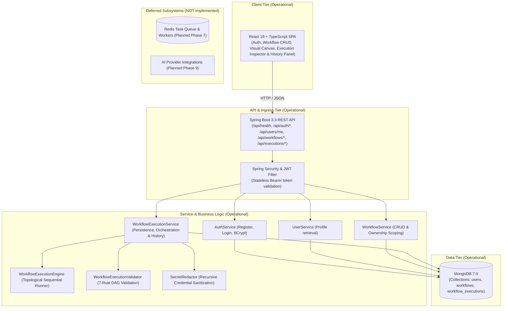

# Adonis Architecture Overview

This document describes the high-level architecture, design principles, and component interactions for the **Adonis** workflow automation platform.

---

## 1. System Vision

Adonis is designed as an event-driven, developer-centric workflow orchestration platform. It balances visual simplicity on the frontend with robust, resilient backend execution using Java 21 and Spring Boot.

### Core Architectural Principles
- **Separation of Concerns**: Visual modeling (Frontend) is decoupled from workflow compilation, validation, and execution (Backend).
- **Extensible Node Ecosystem**: Nodes (triggers, actions, transformers, AI nodes) follow a uniform interface allowing plug-and-play expansions.
- **Fail-Safe & Idempotent**: Step-level retries, execution state journaling, and isolated asynchronous execution.
- **Developer First**: Fully inspectable execution traces, structured logs, and webhook triggers.

---

## 2. Current Architecture (Phase 5 Operational)

In Phase 5, the operational system topology provides an interactive visual workflow canvas integrated with persistent workflow definitions, synchronous in-process workflow execution, and persistent execution history & logs:

```text
React (Vite + TypeScript + Tailwind + @xyflow/react)
   ├── Visual Workflow Builder (Canvas, MiniMap, Controls, Background)
   ├── Node Palette (Trigger, HTTP Request, Generic) & Node Config Drawer
   ├── Run Workflow Action, Execution Results Modal & Execution History Panel
   └── Bidirectional Graph Adapter (workflowAdapter.ts)
   ↓ HTTP / JSON (Bearer JWT, CORS-enabled)
Spring Boot REST API (Java 21, Spring Boot 3.3.4)
   ↓
Spring Security + JWT (Stateless filter, BCrypt password encoder)
   ↓
Service Layer (AuthService, UserService, WorkflowService, WorkflowExecutionService)
   ↓
Execution Engine (Kahn's Topological Sort, Fail-Fast In-Process Sequential Runner)
   ├── WorkflowExecutionValidator (7-rule graph & trigger validation)
   ├── WorkflowExecutionEngine (sequential execution & upstream output resolution)
   ├── NodeExecutors: TriggerNodeExecutor, HttpRequestNodeExecutor, GenericNodeExecutor
   └── SecretRedactor (deep sanitization of sensitive headers, tokens, and credentials)
   ↓
MongoDB (Spring Data MongoDB, 7.0 container)
   ├── Collection: users (unique index on lowercase email)
   ├── Collection: workflows (nodes with positions & edges with handles, indexed by userId)
   └── Collection: workflow_executions (status, timestamps, duration, nodeExecutions, indexed by userId, workflowId, startedAt)
```

### Component Status (Implemented vs. Deferred)

| Subsystem / Component | Current Status | Milestone |
|---|---|---|
| **Core Monorepo & Build Pipeline** | **Operational** | Phase 0 (Completed) |
| **Spring Boot 3.3 REST Baseline** | **Operational** (`GET /api/health`) | Phase 0 (Completed) |
| **React + TypeScript UI Shell** | **Operational** (Landing & Diagnostics) | Phase 0 (Completed) |
| **MongoDB Persistence** | **Operational** (Documents `User`, `Workflow`, `WorkflowExecution`) | Phase 1, 2, 3 & 5 (Completed) |
| **Authentication & User Management** | **Operational** (Stateless JWT + BCrypt) | Phase 1 (Completed) |
| **Protected User Profile API** | **Operational** (`GET /api/users/me`) | Phase 1 (Completed) |
| **Workflow CRUD APIs** | **Operational** (`POST/GET/PUT/DELETE /api/workflows`) | Phase 2 (Completed) |
| **React Flow Visual Canvas** | **Operational** (`@xyflow/react` v12 visual builder) | Phase 3 (Completed) |
| **Workflow Execution Engine** | **Operational** (Topological DAG, in-process, fail-fast) | Phase 4 (Completed) |
| **Execution History & Logs** | **Operational** (Persistent records, skipped nodes, redacting, pagination) | Phase 5 (Completed) |
| **Retries & Failure Handling** | **Operational** (In-process exponential backoff, failure classification, attempt tracking) | Phase 6 (Completed) |
| **Redis Asynchronous Workers** | *NOT Implemented* | Phase 7 (Redis Asynchronous Workers) |
| **Scheduling & Webhooks** | *NOT Implemented* | Phase 8 (Scheduling + Webhooks) |
| **AI Intelligent Nodes** | *NOT Implemented* | Phase 9 (AI Nodes) |
| **Automated Testing & Testcontainers** | *NOT Implemented* | Phase 10 (Testcontainers deferred to Phase 10) |
| **Production Docker Deployment** | *NOT Implemented* | Phase 11 (Docker + Deployment) |
| **CI/CD & Production Hardening** | *NOT Implemented* | Phase 12 (Production Hardening) |

> **Explicit Boundary & Design Principles**:
> - **In-Process & Synchronous Execution**: In Phase 6, execution remains strictly synchronous and in-process within the HTTP request lifecycle. Retries and exponential backoff are performed synchronously via pluggable `RetryDelayStrategy` (defaulting to `Thread.sleep` in production, non-blocking in tests). No background workers, asynchronous queues, job runners, Redis, or Kafka are introduced (deferred to Phase 7).
> - **Failure Classification & Fast Fail**: Failures are classified via `FailureClassifier`. Non-retryable errors (e.g. HTTP 400, 401, 403, 404, invalid URLs) abort retries immediately and fail fast. Retryable errors (e.g. HTTP 408, 429, 500, 502, 503, 504, connection timeouts, refused connections) trigger exponential backoff up to `maxRetries` (retries *after* initial attempt).
> - **Granular Attempt Tracking & Persistence**: Every attempt executed for a node is recorded in `NodeExecutionAttempt` (attempt number, status, timestamps, duration, input, output, error) and persisted within `NodeExecution.attempts` in MongoDB.
> - **Secret Redaction**: Inputs, outputs, and errors are deeply sanitized across every attempt prior to persistence and API response via `SecretRedactor`.
> - **Ownership Isolation**: All execution history endpoints enforce user ownership (`findByIdAndUserId` and `workflowRepository.findByIdAndUserId`). Unauthorized or nonexistent executions return `404 Not Found`.

---

## 3. Workflow Domain & Ownership Isolation

### Workflow Document Structure
Each workflow document in MongoDB (`workflows` collection) represents a persistent graph definition:
- `id`: Unique identifier (auto-generated MongoDB ObjectID string).
- `userId`: Owner ID, strictly set from the verified `UserPrincipal.id()` in JWT.
- `name`: Workflow title (1–100 characters, required).
- `description`: Optional overview (up to 500 characters).
- `status`: Lifecycle state (`DRAFT`, `ACTIVE`).
- `nodes`: List of `WorkflowNode` objects (`id`, `type`, `data`).
- `edges`: List of `WorkflowEdge` objects (`id`, `source`, `target`).
- `createdAt` / `updatedAt`: Server-managed timestamps.

### Ownership Enforcement & Security Guarantees
1. **No Client-Controlled Ownership**: The client cannot specify or mutate `userId`.
2. **Database-Level Isolation**:
   - `findByUserId(userId)` ensures a user's listing only scans and returns their own workflows.
   - `findByIdAndUserId(id, userId)` scopes retrieval, mutation, and deletion to the owner at query time.
3. **No Cross-Tenant Existence Leaks**: Attempting to query, update, or delete a workflow belonging to another user returns `404 Not Found` (never 403), entirely hiding whether the workflow ID exists.

---

## 3. Workflow & Execution Domain & Ownership Isolation

### Workflow Document Structure
Each workflow document in MongoDB (`workflows` collection) represents a persistent graph definition:
- `id`: Unique identifier (auto-generated MongoDB ObjectID string).
- `userId`: Owner ID, strictly set from the verified `UserPrincipal.id()` in JWT.
- `name`: Workflow title (1–100 characters, required).
- `description`: Optional overview (up to 500 characters).
- `status`: Lifecycle state (`DRAFT`, `ACTIVE`).
- `nodes`: List of `WorkflowNode` objects (`id`, `type`, `data`, `position`).
- `edges`: List of `WorkflowEdge` objects (`id`, `source`, `target`, `sourceHandle`, `targetHandle`).
- `createdAt` / `updatedAt`: Server-managed timestamps.

### Workflow Execution Document Structure
Each workflow execution document in MongoDB (`workflow_executions` collection) represents a persistent runtime audit trace:
- `id`: Unique identifier (auto-generated MongoDB ObjectID string).
- `workflowId`: Associated workflow ID (indexed).
- `userId`: Owner ID, strictly set from JWT principal (indexed).
- `status`: Execution state (`RUNNING`, `SUCCESS`, `FAILED`).
- `triggerType`: Trigger type identifier (e.g. `manual`).
- `startedAt`: Timestamp when execution commenced (indexed for descending sort).
- `completedAt`: Timestamp when execution completed.
- `durationMs`: Total duration in milliseconds.
- `nodeExecutions`: Embedded list of `NodeExecution` objects:
  - `nodeId`: ID of the node.
  - `nodeType`: Type (`trigger`, `httpRequest`, `generic`).
  - `status`: Step outcome (`SUCCESS`, `FAILED`, `SKIPPED`).
  - `startedAt` / `completedAt`: Node timestamps.
  - `durationMs`: Node runtime in milliseconds (0ms for skipped nodes).
  - `input`: Deeply sanitized node input map (sensitive keys redacted).
  - `output`: Deeply sanitized node output map (sensitive keys redacted).
  - `error`: Error message if step failed.
- `error`: Overall failure summary message if workflow execution failed.

### Ownership Enforcement & Security Guarantees
1. **No Client-Controlled Ownership**: The client cannot specify or mutate `userId` on workflows or executions.
2. **Database-Level Isolation**:
   - `findByUserId(userId)` and `findAllByUserId(userId, pageable)` ensure listings only scan and return the owner's documents.
   - `findByIdAndUserId(id, userId)` scopes retrieval and mutations strictly to the owner at query time.
3. **No Cross-Tenant Existence Leaks**: Attempting to query, update, or retrieve executions/workflows belonging to another user returns `404 Not Found` (never 403), completely masking resource existence.
4. **Secret Redaction**: Authorization headers, passwords, API keys, client secrets, and bearer tokens are redacted to `[REDACTED]` before saving to MongoDB and returning in HTTP responses.

---

## 4. High-Level Topology (Operational vs Planned)



---

## 5. Current Request Flows

```
[Browser / React App] 
      │
      ├── POST /api/auth/register             ──> Validates input, hashes password (BCrypt), persists User to MongoDB, returns JWT
      ├── POST /api/auth/login                ──> Verifies credentials with BCrypt, returns JWT
      ├── GET  /api/users/me                  ──> Authenticated via Bearer JWT, extracts UserPrincipal, returns UserResponse
      ├── POST /api/workflows                 ──> Authenticated via JWT, binds userId = principal.id(), persists Workflow
      ├── GET  /api/workflows                 ──> Authenticated via JWT, queries findByUserId(principal.id())
      ├── GET  /api/workflows/{id}            ──> Authenticated via JWT, queries findByIdAndUserId, returns 404 on cross-user
      ├── PUT  /api/workflows/{id}            ──> Authenticated via JWT, updates mutable fields, refreshes updatedAt, returns 404 on cross-user
      ├── DELETE /api/workflows/{id}          ──> Authenticated via JWT, deletes own workflow, returns 204 (404 on cross-user)
      ├── POST /api/workflows/{id}/execute    ──> Authenticated via JWT, verifies ownership, validates DAG, persists RUNNING record, executes nodes, redacts secrets, persists outcome (SUCCESS/FAILED + SKIPPED nodes), returns WorkflowExecutionResult
      ├── GET  /api/workflows/{id}/executions ──> Authenticated via JWT, verifies workflow ownership, queries paginated execution summaries (newest first)
      ├── GET  /api/executions/{executionId}  ──> Authenticated via JWT, queries findByIdAndUserId, returns full node-by-node execution record (404 on cross-user)
      ├── GET  /api/executions                ──> Authenticated via JWT, returns paginated execution summaries for authenticated user
      └── GET  /api/health                    ──> Public health diagnostic (Phase 0)
```

---

## 6. Retries & Failure Handling (Phase 6)

Adonis implements an in-process, synchronous retry mechanism designed to make node execution resilient against temporary network partitions, rate limits, and server-side glitches without delaying execution with complex distributed broker setups.

```text
Node Execution Invocation
       │
       ▼
   Attempt 1 ──> [Success] ──> Proceed Downstream with Output
       │ (Failure)
       ▼
Is Failure Retryable? (FailureClassifier)
       ├── No (400, 401, 403, 404, invalid URLs, validation error)
       │     └──> Fast-Fail immediately (No retries wasted) ──> Workflow FAILED (Downstream SKIPPED)
       └── Yes (408, 429, 500, 502, 503, 504, timeout, network error)
             │
             ▼
       Attempts Remaining? (attempt < maxRetries)
             ├── Yes ──> Calculate Backoff (initialBackoffMs * multiplier^attempt, clamped to maxBackoffMs)
             │            │
             │            └──> RetryDelayStrategy.delay(...) ──> Execute Next Attempt
             └── No  ──> Exhausted All Retries ──> Workflow FAILED (Downstream SKIPPED)
```

### Core Architecture Components

1. **Retry Configuration (`RetryConfig`)**:
   - Embedded within `WorkflowNode.data.retryConfig` or `WorkflowNode.data.retry`.
   - Fields: `enabled` (boolean, default false), `maxRetries` (int, default 0, max 10), `initialBackoffMs` (long, default 1000ms), `backoffMultiplier` (double, default 2.0), `maxBackoffMs` (long, default 30000ms, max 60000ms).
   - Strict Semantics: `maxRetries` defines the number of retries *after* the initial failed attempt (total attempts = `1 + maxRetries`).
   - Backward Compatibility: Workflows without a `retryConfig` object default to `enabled: false, maxRetries: 0`.

2. **Decoupled HTTP Failure Semantics & Failure Classifier (`FailureClassifier`)**:
   - `HttpRequestNodeExecutor` consistently reports any HTTP status >= 400 as a failed node execution (`NodeExecutionResult.failure`) regardless of retry configuration, preventing contradictory statuses (`HTTP status = 503, success = false, Node status = SUCCESS`).
   - `FailureClassifier` alone evaluates whether the failure is temporary or permanent:
     - **Retryable**: HTTP status codes 408 (Request Timeout), 429 (Too Many Requests), 500 (Internal Server Error), 502 (Bad Gateway), 503 (Service Unavailable), 504 (Gateway Timeout); network exceptions (e.g. `ConnectException`, `SocketTimeoutException`, `HttpConnectTimeoutException`, connection refused).
     - **Non-Retryable**: HTTP status codes 400 (Bad Request), 401 (Unauthorized), 403 (Forbidden), 404 (Not Found); deterministic client errors (e.g. `IllegalArgumentException`, invalid URL schema, malformed configuration).
     - Conservative Default: Unknown errors or unclassified exceptions default to non-retryable to prevent pointless loops.

3. **Exponential Backoff & Delay Strategy (`RetryPolicy` & `RetryDelayStrategy`)**:
   - Formula: `delay = min(initialBackoffMs * (backoffMultiplier ^ (attempt - 1)), maxBackoffMs)`.
   - Pluggable `RetryDelayStrategy`:
     - Production: `RetryDelayStrategy.threadSleep()` pauses the calling thread synchronously.
     - Testing: `RetryDelayStrategy.noOp()` or mock recording strategies execute synchronously without artificial latency.

4. **Attempt Journaling & Persistence (`NodeExecutionAttempt`)**:
   - Each attempt records: `attemptNumber` (1-indexed), `status` (`SUCCESS` or `FAILED`), `startedAt`, `completedAt`, `durationMs`, `input`, `output`, and `error`.
   - Redaction: Every attempt is sanitized via `SecretRedactor` before being stored on `NodeExecution.attempts` and returned in API responses.
   - The aggregated `NodeExecution` reflects `retryCount` (number of retry attempts triggered), the overall final status, and the complete attempts array.

5. **Downstream Propagation**:
   - When a node succeeds (either on initial attempt or after N retries), its sanitized output is routed as the input to downstream nodes.
   - When a node exhausts its retries or aborts due to a non-retryable error, fail-fast stops execution immediately and unexecuted downstream nodes are marked `SKIPPED`.

---

## 7. Package Architecture (Backend)

```
backend/src/main/java/com/adonis/
├── AdonisApplication.java       # Application Bootstrap
├── config/                      # Web MVC, CORS, and HttpClient configuration
├── controller/                  # REST Controllers (HealthController, AuthController, UserController, WorkflowController, ExecutionController)
├── dto/                         # Strongly-typed Java 21 Records (CreateWorkflowRequest, WorkflowResponse, ExecutionResponse, ExecutionSummaryResponse, NodeExecutionResponse, NodeExecutionAttemptResponse, PageResponse)
├── exception/                   # Global exception handling (GlobalExceptionHandler, WorkflowValidationException, ExecutionNotFoundException)
├── execution/                   # Workflow Execution Engine, Retry Policies & Service
│   ├── ExecutionContext.java            # Runtime thread-safe execution state
│   ├── ExecutionStatus.java             # RUNNING, SUCCESS, FAILED, SKIPPED status enum
│   ├── FailureClassifier.java           # Retryable vs non-retryable error classifier
│   ├── GenericNodeExecutor.java         # Pass-through generic node executor
│   ├── HttpRequestNodeExecutor.java     # JDK HttpClient executor for GET/POST/PUT/DELETE/PATCH
│   ├── NodeExecutionResult.java         # Node execution output, duration, retry count, attempts, and error record
│   ├── NodeExecutor.java                # Extensible node executor interface
│   ├── RetryDelayStrategy.java          # Pluggable backoff delay interface (threadSleep vs noOp)
│   ├── RetryPolicy.java                 # Exponential backoff loop, attempt tracking, and logging
│   ├── TriggerNodeExecutor.java         # Starting trigger node executor
│   ├── WorkflowExecutionEngine.java     # In-process sequential runner with fail-fast semantics
│   ├── WorkflowExecutionResult.java     # Overall workflow execution outcome record
│   ├── WorkflowExecutionService.java    # Ownership lookup, persistence lifecycle & query orchestration
│   └── WorkflowExecutionValidator.java  # 7-rule graph validation & Kahn's topological sort
├── model/                       # MongoDB Document Models (User, Workflow, WorkflowNode, WorkflowEdge, WorkflowStatus, WorkflowExecution, NodeExecution, NodeExecutionAttempt, RetryConfig)
├── repository/                  # Spring Data MongoDB Repositories (UserRepository, WorkflowRepository, WorkflowExecutionRepository)
├── security/                    # SecurityConfig, JwtService, JwtAuthenticationFilter, UserPrincipal
├── util/                        # Utilities (SecretRedactor deep recursive credential sanitization)
└── service/                     # Business Logic (AuthService, UserService, WorkflowService)
```

---

## 8. Port Allocations & Networking

| Service | Internal Port | Host / Exposed Port | Protocol | Status | Purpose |
|---|---|---|---|---|---|
| `frontend` | 80 (prod) / 5173 (dev) | 5173 | HTTP | **Operational** | User Interface & Workflow CRUD Dashboard |
| `backend` | 8080 | 8080 | HTTP | **Operational** | REST API & Security Engine |
| `mongodb` | 27017 | 27017 | TCP | **Operational** | MongoDB 7.0 User & Workflow Persistence |
| `redis` | 6379 | 6379 | TCP | *Deferred (Phase 7)* | Async job queue & worker tasks |

