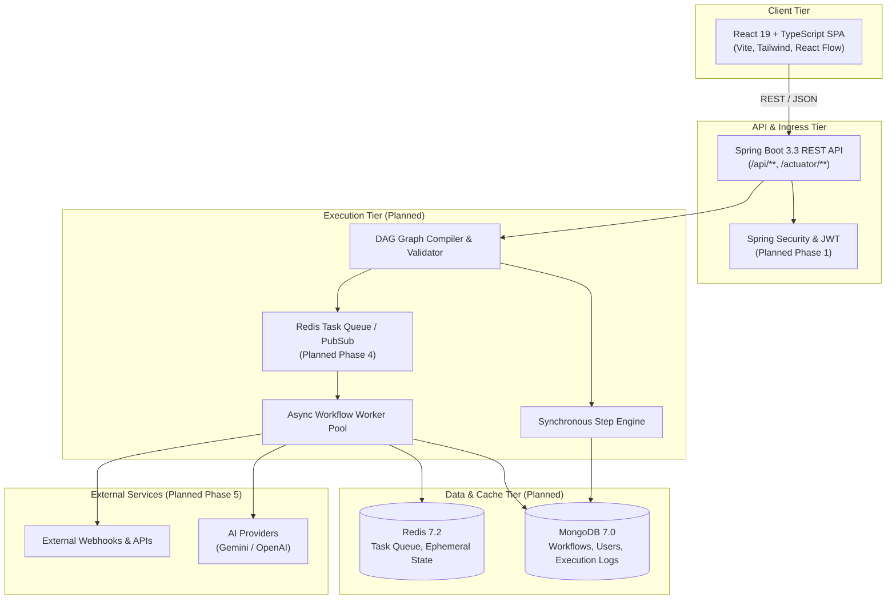

# Adonis Architecture Overview

This document describes the high-level architecture, design principles, and component interactions for the **Adonis** workflow automation platform.

---

## 1. System Vision

Adonis is designed as an event-driven, developer-centric workflow orchestration platform. It balances visual simplicity on the frontend with robust, resilient backend execution using Java 21 and Spring Boot.

### Core Architectural Principles
- **Separation of Concerns**: Visual modeling (Frontend) is decoupled from workflow compilation, validation, and execution (Backend).
- **Extensible Node Ecosystem**: Nodes (triggers, actions, transformers, AI nodes) follow a uniform interface allowing plug-and-play expansions.
- **Fail-Safe & Idempotent**: Step-level retries, execution state journaling, and isolated asynchronous execution.
- **Developer First**: Fully inspectable execution traces, structured logs, and webhook triggers.

---

## 2. High-Level Component Topology



---

## 3. Current Phase 0 Architecture

In Phase 0, the baseline client-server communication and runtime infrastructure are established:

```
[Browser / React App] 
      │
      │  HTTP GET /api/health (CORS-enabled)
      ▼
[Spring Boot 3.3.4 Application]
      │
      ├── HealthController (`/api/health`) ──> Returns service name, version, status UP
      └── Actuator (`/actuator/health`)    ──> Returns subsystem health metrics
```

### Component Breakdown

| Component | Responsibility in Phase 0 | Technology |
|---|---|---|
| `frontend` | Visual interface, landing shell, and backend health diagnostic | React, TypeScript, Vite, Tailwind CSS |
| `backend` | Core REST entry point, health endpoint, Spring Boot web runtime | Java 21, Spring Boot 3.3.4, Maven |
| `docker` | Multi-stage container definitions for isolated builds | Docker, Docker Compose |
| `.github/workflows` | Continuous integration pipeline verifying build and test integrity | GitHub Actions |

---

## 4. Package Architecture (Backend)

The backend follows a layered architecture with strict dependency flow:

```
backend/src/main/java/com/adonis/
├── AdonisApplication.java       # Application Bootstrap
├── config/                      # Web MVC, CORS, and cross-cutting beans
├── controller/                  # REST Controllers (exposing HTTP endpoints)
├── dto/                         # Strongly-typed Data Transfer Records
├── exception/                   # Global exception handling & API error formats (Phase 1+)
├── model/                       # Domain entities & MongoDB documents (Phase 1+)
├── repository/                  # Spring Data MongoDB repositories (Phase 1+)
├── security/                    # Spring Security configuration, JWT filters (Phase 1+)
└── service/                     # Workflow business logic & orchestration (Phase 3+)
```

---

## 5. Port Allocations & Networking

| Service | Internal Port | Host / Exposed Port | Protocol | Purpose |
|---|---|---|---|---|
| `frontend` | 80 (prod) / 5173 (dev) | 5173 | HTTP | User Interface |
| `backend` | 8080 | 8080 | HTTP | REST API & Engine |
| `mongodb` | 27017 | 27017 | TCP | Workflow & User persistence *(Reserved)* |
| `redis` | 6379 | 6379 | TCP | Async job queue *(Reserved)* |
