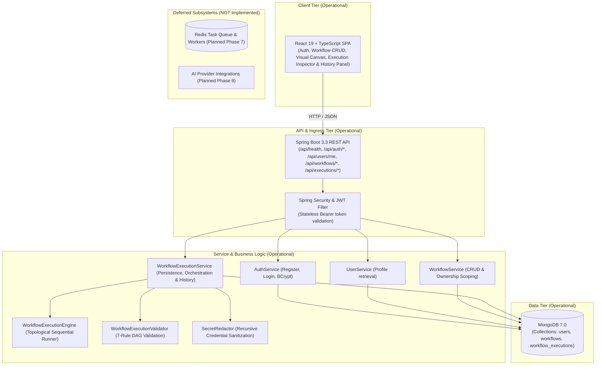

# Adonis Architecture Overview

This document describes the high-level architecture, design principles, and component interactions for the **Adonis** workflow automation platform.

---

## 1. System Vision

Adonis is designed as an event-driven, developer-centric workflow orchestration platform. It balances visual simplicity on the frontend with robust, resilient backend execution using Java 21 and Spring Boot.

### Core Architectural Principles
- **Separation of Concerns**: Visual modeling (Frontend) is decoupled from workflow compilation, validation, and execution (Backend).
- **Extensible Node Ecosystem**: Nodes (triggers, actions, transformers, AI nodes) follow a uniform interface allowing plug-and-play expansions.
- **Fail-Safe & Idempotent**: Step-level retries, execution state journaling, and isolated asynchronous execution.
- **Developer First**: Fully inspectable execution traces, structured logs, and webhook triggers.

---

## 2. Current Architecture (Phase 5 Operational)

In Phase 5, the operational system topology provides an interactive visual workflow canvas integrated with persistent workflow definitions, synchronous in-process workflow execution, and persistent execution history & logs:

```text
React (Vite + TypeScript + Tailwind + @xyflow/react)
   ├── Visual Workflow Builder (Canvas, MiniMap, Controls, Background)
   ├── Node Palette (Trigger, HTTP Request, Generic) & Node Config Drawer
   ├── Run Workflow Action, Execution Results Modal & Execution History Panel
   └── Bidirectional Graph Adapter (workflowAdapter.ts)
   ↓ HTTP / JSON (Bearer JWT, CORS-enabled)
Spring Boot REST API (Java 21, Spring Boot 3.3.4)
   ↓
Spring Security + JWT (Stateless filter, BCrypt password encoder)
   ↓
Service Layer (AuthService, UserService, WorkflowService, WorkflowExecutionService)
   ↓
Execution Engine (Kahn's Topological Sort, Fail-Fast In-Process Sequential Runner)
   ├── WorkflowExecutionValidator (7-rule graph & trigger validation)
   ├── WorkflowExecutionEngine (sequential execution & upstream output resolution)
   ├── NodeExecutors: TriggerNodeExecutor, HttpRequestNodeExecutor, GenericNodeExecutor
   └── SecretRedactor (deep sanitization of sensitive headers, tokens, and credentials)
   ↓
MongoDB (Spring Data MongoDB, 7.0 container)
   ├── Collection: users (unique index on lowercase email)
   ├── Collection: workflows (nodes with positions & edges with handles, indexed by userId)
   └── Collection: workflow_executions (status, timestamps, duration, nodeExecutions, indexed by userId, workflowId, startedAt)
```

### Component Status (Implemented vs. Deferred)

| Subsystem / Component | Current Status | Milestone |
|---|---|---|
| **Core Monorepo & Build Pipeline** | **Operational** | Phase 0 (Completed) |
| **Spring Boot 3.3 REST Baseline** | **Operational** (`GET /api/health`) | Phase 0 (Completed) |
| **React + TypeScript UI Shell** | **Operational** (Landing & Diagnostics) | Phase 0 (Completed) |
| **MongoDB Persistence** | **Operational** (Documents `User`, `Workflow`, `WorkflowExecution`) | Phase 1, 2, 3 & 5 (Completed) |
| **Authentication & User Management** | **Operational** (Stateless JWT + BCrypt) | Phase 1 (Completed) |
| **Protected User Profile API** | **Operational** (`GET /api/users/me`) | Phase 1 (Completed) |
| **Workflow CRUD APIs** | **Operational** (`POST/GET/PUT/DELETE /api/workflows`) | Phase 2 (Completed) |
| **React Flow Visual Canvas** | **Operational** (`@xyflow/react` v12 visual builder) | Phase 3 (Completed) |
| **Workflow Execution Engine** | **Operational** (Topological DAG, in-process, fail-fast) | Phase 4 (Completed) |
| **Execution History & Logs** | **Operational** (Persistent records, skipped nodes, redacting, pagination) | Phase 5 (Completed) |
| **Retries & Failure Handling** | *NOT Implemented* | Phase 6 (Retries + Failure Handling) |
| **Redis Asynchronous Workers** | *NOT Implemented* | Phase 7 (Redis Asynchronous Workers) |
| **Scheduling & Webhooks** | *NOT Implemented* | Phase 8 (Scheduling + Webhooks) |
| **AI Intelligent Nodes** | *NOT Implemented* | Phase 9 (AI Nodes) |
| **Automated Testing & Testcontainers** | *NOT Implemented* | Phase 10 (Testcontainers deferred to Phase 10) |
| **Production Docker Deployment** | *NOT Implemented* | Phase 11 (Docker + Deployment) |
| **CI/CD & Production Hardening** | *NOT Implemented* | Phase 12 (Production Hardening) |

> **Explicit Boundary & Design Principles**:
> - **In-Process & Synchronous Execution**: In Phase 5, execution remains strictly synchronous and in-process within the HTTP request lifecycle. No background workers, asynchronous queues, job runners, Redis, or Kafka are introduced.
> - **Execution Journaling & Persistence**: Every workflow run creates a persistent `WorkflowExecution` document in MongoDB initialized with `status: RUNNING`. Upon completion or failure, the record is updated with final status (`SUCCESS` or `FAILED`), completion timestamp, duration in milliseconds, and node execution traces.
> - **Fail-Fast Error Handling & Skipped Nodes**: If a node fails during execution, sequential runner stops immediately. The failed node is recorded with its error, unexecuted downstream nodes in the planned topological order are recorded as `SKIPPED`, and overall status becomes `FAILED`.
> - **Secret Redaction**: Inputs, outputs, and errors are deeply sanitized prior to persistence. Headers such as `Authorization`, `X-Api-Key`, passwords, client secrets, and Bearer tokens are redacted to `[REDACTED]`.
> - **Ownership Isolation**: All execution history endpoints enforce user ownership (`findByIdAndUserId` and `workflowRepository.findByIdAndUserId`). Unauthorized or nonexistent executions return `404 Not Found`.
> - **Redis Deferral**: Redis and queue workers remain strictly deferred to Phase 7.

---

## 3. Workflow Domain & Ownership Isolation

### Workflow Document Structure
Each workflow document in MongoDB (`workflows` collection) represents a persistent graph definition:
- `id`: Unique identifier (auto-generated MongoDB ObjectID string).
- `userId`: Owner ID, strictly set from the verified `UserPrincipal.id()` in JWT.
- `name`: Workflow title (1–100 characters, required).
- `description`: Optional overview (up to 500 characters).
- `status`: Lifecycle state (`DRAFT`, `ACTIVE`).
- `nodes`: List of `WorkflowNode` objects (`id`, `type`, `data`).
- `edges`: List of `WorkflowEdge` objects (`id`, `source`, `target`).
- `createdAt` / `updatedAt`: Server-managed timestamps.

### Ownership Enforcement & Security Guarantees
1. **No Client-Controlled Ownership**: The client cannot specify or mutate `userId`.
2. **Database-Level Isolation**:
   - `findByUserId(userId)` ensures a user's listing only scans and returns their own workflows.
   - `findByIdAndUserId(id, userId)` scopes retrieval, mutation, and deletion to the owner at query time.
3. **No Cross-Tenant Existence Leaks**: Attempting to query, update, or delete a workflow belonging to another user returns `404 Not Found` (never 403), entirely hiding whether the workflow ID exists.

---

## 3. Workflow & Execution Domain & Ownership Isolation

### Workflow Document Structure
Each workflow document in MongoDB (`workflows` collection) represents a persistent graph definition:
- `id`: Unique identifier (auto-generated MongoDB ObjectID string).
- `userId`: Owner ID, strictly set from the verified `UserPrincipal.id()` in JWT.
- `name`: Workflow title (1–100 characters, required).
- `description`: Optional overview (up to 500 characters).
- `status`: Lifecycle state (`DRAFT`, `ACTIVE`).
- `nodes`: List of `WorkflowNode` objects (`id`, `type`, `data`, `position`).
- `edges`: List of `WorkflowEdge` objects (`id`, `source`, `target`, `sourceHandle`, `targetHandle`).
- `createdAt` / `updatedAt`: Server-managed timestamps.

### Workflow Execution Document Structure
Each workflow execution document in MongoDB (`workflow_executions` collection) represents a persistent runtime audit trace:
- `id`: Unique identifier (auto-generated MongoDB ObjectID string).
- `workflowId`: Associated workflow ID (indexed).
- `userId`: Owner ID, strictly set from JWT principal (indexed).
- `status`: Execution state (`RUNNING`, `SUCCESS`, `FAILED`).
- `triggerType`: Trigger type identifier (e.g. `manual`).
- `startedAt`: Timestamp when execution commenced (indexed for descending sort).
- `completedAt`: Timestamp when execution completed.
- `durationMs`: Total duration in milliseconds.
- `nodeExecutions`: Embedded list of `NodeExecution` objects:
  - `nodeId`: ID of the node.
  - `nodeType`: Type (`trigger`, `httpRequest`, `generic`).
  - `status`: Step outcome (`SUCCESS`, `FAILED`, `SKIPPED`).
  - `startedAt` / `completedAt`: Node timestamps.
  - `durationMs`: Node runtime in milliseconds (0ms for skipped nodes).
  - `input`: Deeply sanitized node input map (sensitive keys redacted).
  - `output`: Deeply sanitized node output map (sensitive keys redacted).
  - `error`: Error message if step failed.
- `error`: Overall failure summary message if workflow execution failed.

### Ownership Enforcement & Security Guarantees
1. **No Client-Controlled Ownership**: The client cannot specify or mutate `userId` on workflows or executions.
2. **Database-Level Isolation**:
   - `findByUserId(userId)` and `findAllByUserId(userId, pageable)` ensure listings only scan and return the owner's documents.
   - `findByIdAndUserId(id, userId)` scopes retrieval and mutations strictly to the owner at query time.
3. **No Cross-Tenant Existence Leaks**: Attempting to query, update, or retrieve executions/workflows belonging to another user returns `404 Not Found` (never 403), completely masking resource existence.
4. **Secret Redaction**: Authorization headers, passwords, API keys, client secrets, and bearer tokens are redacted to `[REDACTED]` before saving to MongoDB and returning in HTTP responses.

---

## 4. High-Level Topology (Operational vs Planned)



---

## 5. Current Request Flows

```
[Browser / React App] 
      │
      ├── POST /api/auth/register             ──> Validates input, hashes password (BCrypt), persists User to MongoDB, returns JWT
      ├── POST /api/auth/login                ──> Verifies credentials with BCrypt, returns JWT
      ├── GET  /api/users/me                  ──> Authenticated via Bearer JWT, extracts UserPrincipal, returns UserResponse
      ├── POST /api/workflows                 ──> Authenticated via JWT, binds userId = principal.id(), persists Workflow
      ├── GET  /api/workflows                 ──> Authenticated via JWT, queries findByUserId(principal.id())
      ├── GET  /api/workflows/{id}            ──> Authenticated via JWT, queries findByIdAndUserId, returns 404 on cross-user
      ├── PUT  /api/workflows/{id}            ──> Authenticated via JWT, updates mutable fields, refreshes updatedAt, returns 404 on cross-user
      ├── DELETE /api/workflows/{id}          ──> Authenticated via JWT, deletes own workflow, returns 204 (404 on cross-user)
      ├── POST /api/workflows/{id}/execute    ──> Authenticated via JWT, verifies ownership, validates DAG, persists RUNNING record, executes nodes, redacts secrets, persists outcome (SUCCESS/FAILED + SKIPPED nodes), returns WorkflowExecutionResult
      ├── GET  /api/workflows/{id}/executions ──> Authenticated via JWT, verifies workflow ownership, queries paginated execution summaries (newest first)
      ├── GET  /api/executions/{executionId}  ──> Authenticated via JWT, queries findByIdAndUserId, returns full node-by-node execution record (404 on cross-user)
      ├── GET  /api/executions                ──> Authenticated via JWT, returns paginated execution summaries for authenticated user
      └── GET  /api/health                    ──> Public health diagnostic (Phase 0)
```

---

## 6. Package Architecture (Backend)

```
backend/src/main/java/com/adonis/
├── AdonisApplication.java       # Application Bootstrap
├── config/                      # Web MVC, CORS, and HttpClient configuration
├── controller/                  # REST Controllers (HealthController, AuthController, UserController, WorkflowController, ExecutionController)
├── dto/                         # Strongly-typed Java 21 Records (CreateWorkflowRequest, WorkflowResponse, ExecutionResponse, ExecutionSummaryResponse, NodeExecutionResponse, PageResponse)
├── exception/                   # Global exception handling (GlobalExceptionHandler, WorkflowValidationException, ExecutionNotFoundException)
├── execution/                   # Workflow Execution Engine & Service
│   ├── ExecutionContext.java            # Runtime thread-safe execution state
│   ├── ExecutionStatus.java             # RUNNING, SUCCESS, FAILED, SKIPPED status enum
│   ├── GenericNodeExecutor.java         # Pass-through generic node executor
│   ├── HttpRequestNodeExecutor.java     # JDK HttpClient executor for GET/POST/PUT/DELETE/PATCH
│   ├── NodeExecutionResult.java         # Node execution output, duration, and error record
│   ├── NodeExecutor.java                # Extensible node executor interface
│   ├── TriggerNodeExecutor.java         # Starting trigger node executor
│   ├── WorkflowExecutionEngine.java     # In-process sequential runner with fail-fast semantics
│   ├── WorkflowExecutionResult.java     # Overall workflow execution outcome record
│   ├── WorkflowExecutionService.java    # Ownership lookup, persistence lifecycle & query orchestration
│   └── WorkflowExecutionValidator.java  # 7-rule graph validation & Kahn's topological sort
├── model/                       # MongoDB Document Models (User, Workflow, WorkflowNode, WorkflowEdge, WorkflowStatus, WorkflowExecution, NodeExecution)
├── repository/                  # Spring Data MongoDB Repositories (UserRepository, WorkflowRepository, WorkflowExecutionRepository)
├── security/                    # SecurityConfig, JwtService, JwtAuthenticationFilter, UserPrincipal
├── util/                        # Utilities (SecretRedactor deep recursive credential sanitization)
└── service/                     # Business Logic (AuthService, UserService, WorkflowService)
```

---

## 7. Port Allocations & Networking

| Service | Internal Port | Host / Exposed Port | Protocol | Status | Purpose |
|---|---|---|---|---|---|
| `frontend` | 80 (prod) / 5173 (dev) | 5173 | HTTP | **Operational** | User Interface & Workflow CRUD Dashboard |
| `backend` | 8080 | 8080 | HTTP | **Operational** | REST API & Security Engine |
| `mongodb` | 27017 | 27017 | TCP | **Operational** | MongoDB 7.0 User & Workflow Persistence |
| `redis` | 6379 | 6379 | TCP | *Deferred (Phase 7)* | Async job queue & worker tasks |

