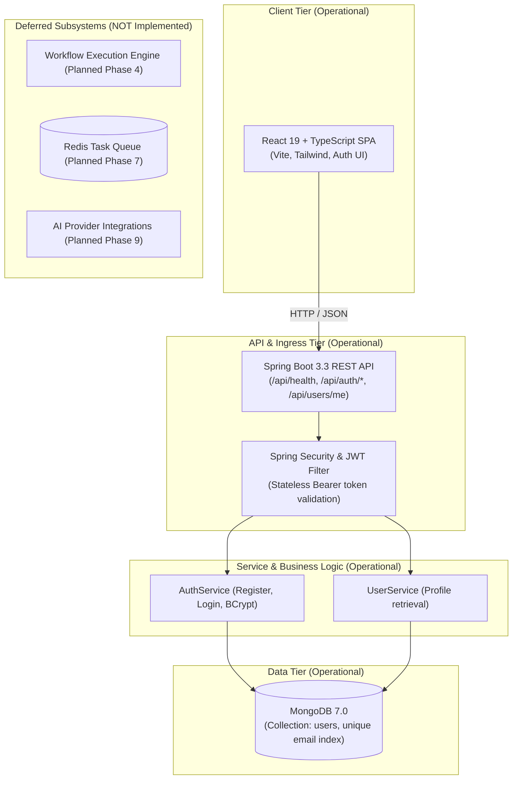

# Adonis Architecture Overview

This document describes the high-level architecture, design principles, and component interactions for the **Adonis** workflow automation platform.

---

## 1. System Vision

Adonis is designed as an event-driven, developer-centric workflow orchestration platform. It balances visual simplicity on the frontend with robust, resilient backend execution using Java 21 and Spring Boot.

### Core Architectural Principles
- **Separation of Concerns**: Visual modeling (Frontend) is decoupled from workflow compilation, validation, and execution (Backend).
- **Extensible Node Ecosystem**: Nodes (triggers, actions, transformers, AI nodes) follow a uniform interface allowing plug-and-play expansions.
- **Fail-Safe & Idempotent**: Step-level retries, execution state journaling, and isolated asynchronous execution.
- **Developer First**: Fully inspectable execution traces, structured logs, and webhook triggers.

---

## 2. Current Architecture (Phase 1 Operational)

In Phase 1, the operational system topology follows a clean layered pipeline:

```text
React (Vite + TypeScript + Tailwind)
   ↓ HTTP / JSON (CORS-enabled)
Spring Boot REST API (Java 21, Spring Boot 3.3.4)
   ↓
Spring Security + JWT (Stateless filter, BCrypt password encoder)
   ↓
User Management (AuthService, UserService)
   ↓
MongoDB (Spring Data MongoDB, 7.0 container, unique index on lowercase email)
```

### Component Status (Implemented vs. Deferred)

| Subsystem / Component | Current Status | Milestone |
|---|---|---|
| **Core Monorepo & Build Pipeline** | **Operational** | Phase 0 (Completed) |
| **Spring Boot 3.3 REST Baseline** | **Operational** (`GET /api/health`) | Phase 0 (Completed) |
| **React + TypeScript UI Shell** | **Operational** (Landing & Diagnostics) | Phase 0 (Completed) |
| **MongoDB Persistence** | **Operational** (Document `User`, collection `users`) | Phase 1 (Completed) |
| **Authentication & User Management** | **Operational** (Stateless JWT + BCrypt) | Phase 1 (Completed) |
| **Protected User Profile API** | **Operational** (`GET /api/users/me`) | Phase 1 (Completed) |
| **Workflow CRUD APIs** | *NOT Implemented* | Phase 2 (Workflow CRUD) |
| **React Flow Visual Canvas** | *NOT Implemented* | Phase 3 (React Flow Builder) |
| **Workflow Execution Engine** | *NOT Implemented* | Phase 4 (Execution Engine) |
| **Execution History & Logs** | *NOT Implemented* | Phase 5 (Execution History + Logs) |
| **Retries & Failure Handling** | *NOT Implemented* | Phase 6 (Retries + Failure Handling) |
| **Redis Asynchronous Workers** | *NOT Implemented* | Phase 7 (Redis Asynchronous Workers) |
| **Scheduling & Webhooks** | *NOT Implemented* | Phase 8 (Scheduling + Webhooks) |
| **AI Intelligent Nodes** | *NOT Implemented* | Phase 9 (AI Nodes) |
| **Automated Testing & Testcontainers** | *NOT Implemented* | Phase 10 (Testcontainers deferred to Phase 10) |
| **Production Docker Deployment** | *NOT Implemented* | Phase 11 (Docker + Deployment) |
| **CI/CD & Production Hardening** | *NOT Implemented* | Phase 12 (Production Hardening) |

---

## 3. High-Level Topology (Current Operational vs Future Planned)



---

## 4. Current Phase 1 Request Flows

```
[Browser / React App] 
      │
      ├── POST /api/auth/register ──> Validates input, hashes password (BCrypt), persists User to MongoDB, returns JWT
      ├── POST /api/auth/login    ──> Verifies credentials with BCrypt, returns JWT (generic 401 on failure)
      ├── GET  /api/users/me      ──> Authenticated via Bearer JWT, extracts UserPrincipal, returns UserResponse
      └── GET  /api/health        ──> Public health diagnostic (Phase 0)
```

---

## 5. Package Architecture (Backend)

The backend follows a layered architecture with strict dependency flow:

```
backend/src/main/java/com/adonis/
├── AdonisApplication.java       # Application Bootstrap
├── config/                      # Web MVC, CORS configuration
├── controller/                  # REST Controllers (HealthController, AuthController, UserController)
├── dto/                         # Strongly-typed Java 21 Records (RegisterRequest, LoginRequest, UserResponse, AuthResponse, ErrorResponse)
├── exception/                   # Global exception handling (GlobalExceptionHandler, EmailAlreadyExistsException, UserNotFoundException)
├── model/                       # MongoDB Document Models (User)
├── repository/                  # Spring Data MongoDB Repositories (UserRepository)
├── security/                    # SecurityConfig, JwtService, JwtAuthenticationFilter, UserPrincipal
└── service/                     # Business Logic (AuthService, UserService)
```

---

## 6. Port Allocations & Networking

| Service | Internal Port | Host / Exposed Port | Protocol | Status | Purpose |
|---|---|---|---|---|---|
| `frontend` | 80 (prod) / 5173 (dev) | 5173 | HTTP | **Operational** | User Interface & Auth Dashboard |
| `backend` | 8080 | 8080 | HTTP | **Operational** | REST API & Security Engine |
| `mongodb` | 27017 | 27017 | TCP | **Operational** | MongoDB 7.0 User Persistence |
| `redis` | 6379 | 6379 | TCP | *Deferred (Phase 7)* | Async job queue & worker tasks |
